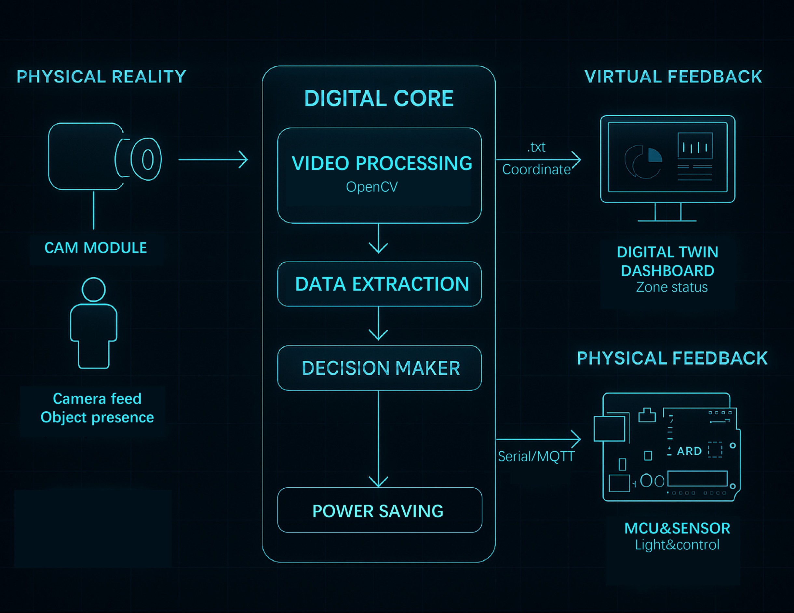
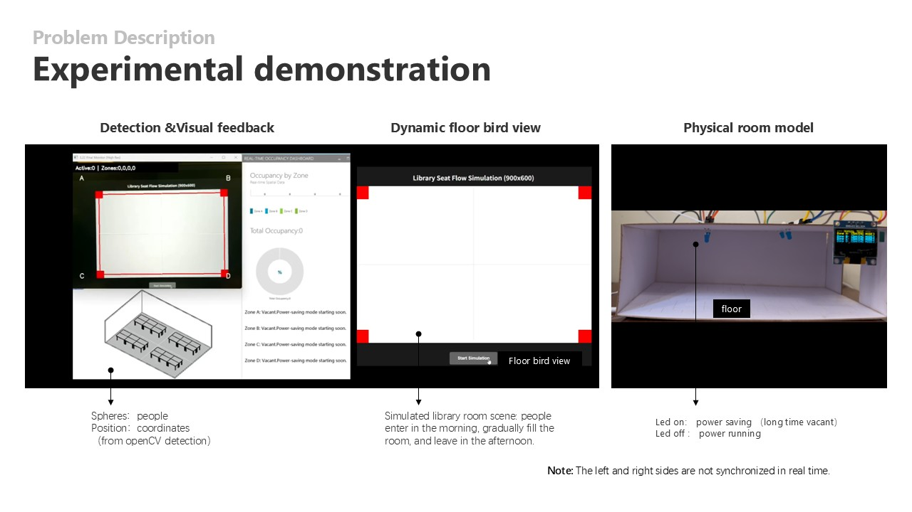

# EcoSight: Privacy-Preserving Building Spatial Optimization

**EcoSight** is an edge-computing-powered system designed to optimize building spatial efficiency and energy consumption while strictly maintaining user privacy. By translating real-time environmental data into anonymous spatial coordinates, EcoSight bridges the gap between granular occupancy sensing and data security.

## Core Vision
* **Privacy-First**: No images are recorded or transmitted; only numerical coordinates are processed locally and destroyed instantly.
* **Energy Efficient**: Targets a 15–30% reduction in lighting and HVAC electricity usage through behavior-driven occupancy logic.
* **Interdisciplinary Integration**: Built for architects and facility managers using industry-standard tools like Rhino and Grasshopper for zero-barrier technical adoption.

## System Architecture

  

The project operates as a closed-loop **Cyber-Physical System (CPS)**:
1. **Sense (Edge AI)**: Ceiling-mounted sensors capture top-down views. OpenCV algorithms execute head detection and track seat-level occupancy locally.
2. **Transfer**: Anonymous coordinate strings are transmitted via low-latency protocols such as UDP or Serial.
3. **React (Digital Twin)**: A real-time dashboard in Rhino/Grasshopper visualizes data as "occupancy spheres" and automates building responses, such as switching zones to power-saving mode.

## Project Demonstration

  

## Technical Stack
* **Computer Vision**: Python, OpenCV.
* **Hardware**: Edge-AI modules (e.g., OpenMV, ESP32-CAM) and Arduino-based MCUs.
* **Design & Simulation**: Rhino 7, Grasshopper (Digital Twin dashboard).

---

## Notice
*This repository contains the conceptual framework and prototype documentation for the EcoSight project. Specific proprietary algorithms and detailed experimental datasets are currently restricted to protect project integrity during the development phase.*
